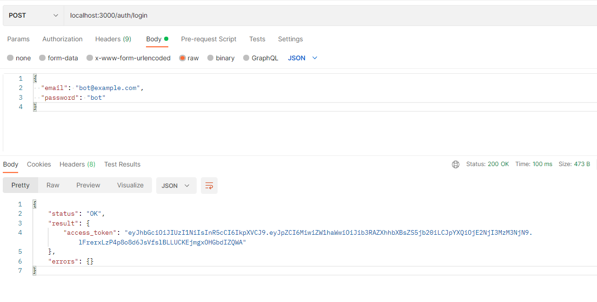
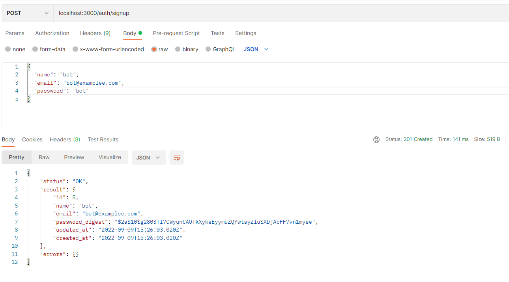

# Restful API with Express Sequelize and PostgreSQL

## Setup
Clone the repo and install dependencies via NPM:

	npm install

Install Sequelize-cli globally, so that you can run Sequelize command line operations from the project root

	npm install -g sequelize-cli

### Environments
When connecting to the database, sequelize need to get the information about the database's name, username, password, and host from env file. You also need to provide the JWT secret key into the env. You can also set your application PORT (default PORT is 3000)

### Creating the database
Once you have set your database's name in the env file, you can run the database create with secuelize-cli. From the project root run:

    npx sequelize-cli db:create

### Migrating the database
Migrations are included to set up the necessary database tables for the models.
Run migrations using the sequelize-cli. From the project root run:

	npx sequelize-cli db:migrate

Sequelize will then create the tables in the database.

### Seeding sample data
There are seeder files in seeders to insert sample data into the database. To run the seed process and populate the database tables, run the following from the project root:

	npx sequelize-cli db:seed:all

### Run application
Once youve done all the step above, you can then run index.js in node, or use nodemon to run the app local. From the project root run:

	npm start

## Routes / Endpoints
When the app running, you can then make request to the server. The following routes are set up, and will return JSON data:

#### auth
+ **POST** login: /auth/login
+ **POST** signup: /auth/signup

#### products v1
+ **GET** all products: /v1/products
+ **GET** single product by id: /v1/products/{id}
+ **POST** new product: /v1/products
+ **PUT** edit a single product: /v1/products/{id}
+ **DELETE** delete a single product: /v1/products/{id}

#### products v2
+ **GET** return Hello there: /v2/products

### Postman Documentation

#### Postman Collection

    https://www.getpostman.com/collections/8bae144854bb80fd4bb9

#### auth - login

#### auth - signup

#### product v1 - create

#### product v1 - show

#### product v1 - show by id

#### product v1 - update

#### product v1 - delete

#### product v2 - show

